[Index](Index.md)

## Screen Shots

- [v0.5.0](#v0.5.0)
- [v0.4.4](#v0.4.4)
- [v0.4.3](#v0.4.3)
- [v0.4](#v0.4)
- [v0.3](#v0.3)
- [v0.1](#v0.1)
- [Original](#Original)

### v0.5.0

A simple scenario with 100 robots running the same test case
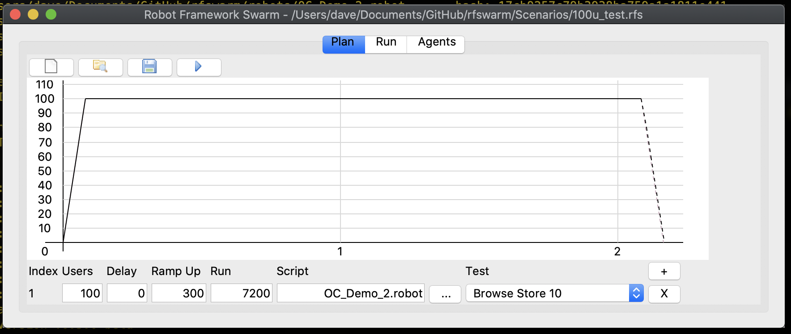

An example scenario with 2 test groups of 10 robots each running the same test case, the second group starts 420 seconds after the first.

A gradual ramp-up scenario (Scalability Test) with 6 test groups of 25 robots each running the same test case, each test group starts 600 seconds (10 minutes) after the previous one, until 150 users are running.

An example scenario with 3 test groups each running a different test case, and the second group starts with a 30 second delay.
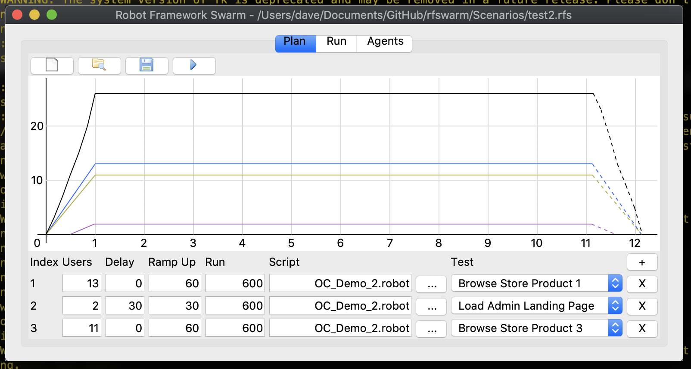

Less than a minute into the run starting to get results (new method of gathering results on the agent is working well)

More than a minute in and getting more results, now getting Standard Deviation and Percentile results.

2 hours into run, this shows that rfswarm can handle large number of samples well and sustain a run of 100 users over 2 hours
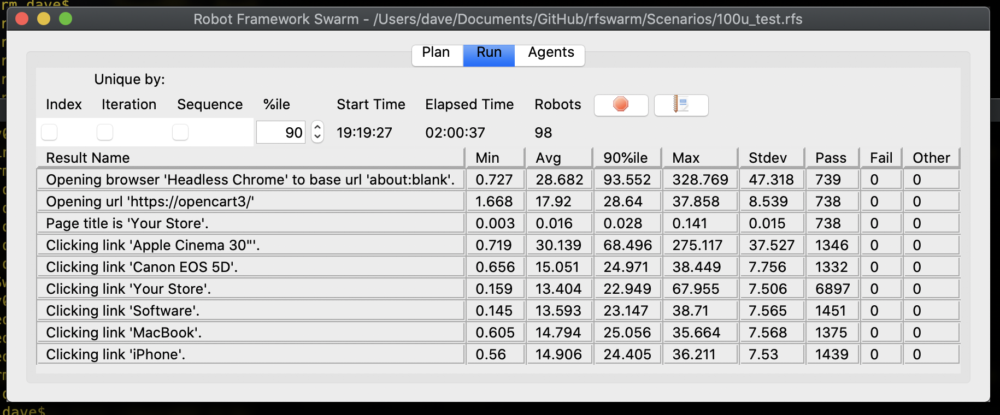

Run finished sucessfully after 2 hours 20, all robots have stopped.
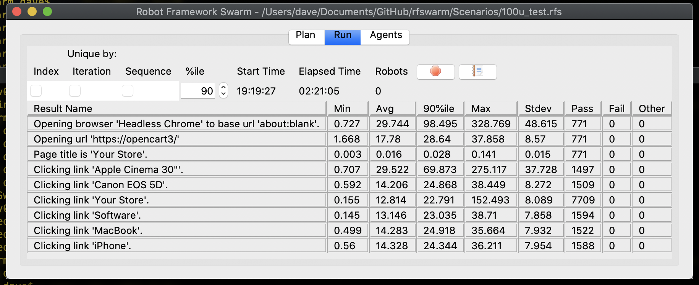

Clicking the export button (next to stop button) a dialogue gives you the path where the results are stored

Results export generates 3 csv files:
- test_summary.csv, contains the table in the run screen with the Standard Deviation and Percentile results
- test_agent_data.csv, contains the raw agent status updates, and could be useful for creating a running robots graph.
- test_raw_result.csv, contains the raw result data, and could be useful for creating various graphs.

The sqlite3 database from the test run is also available to enable easy reporting of test results, the db file is retained regardless of clicking the export button or not.

Screen shot showing agents when running a test, here you can see one agent is in warning state as memory consumption has exceeded 80%

Screen shot showing the prompt to save changes to scenario when closing the application

Screen shot showing a run failing due to an overloaded agent, similarly when the application being tested fails you will see similar error messages with pass or fail counts depending on the library your test uses.
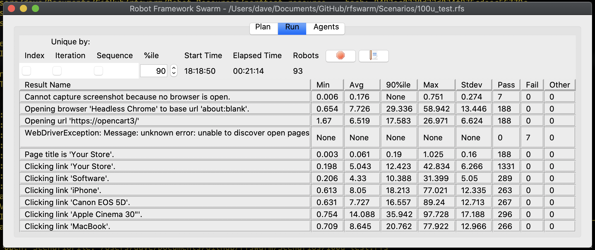

Linux Mint 19:

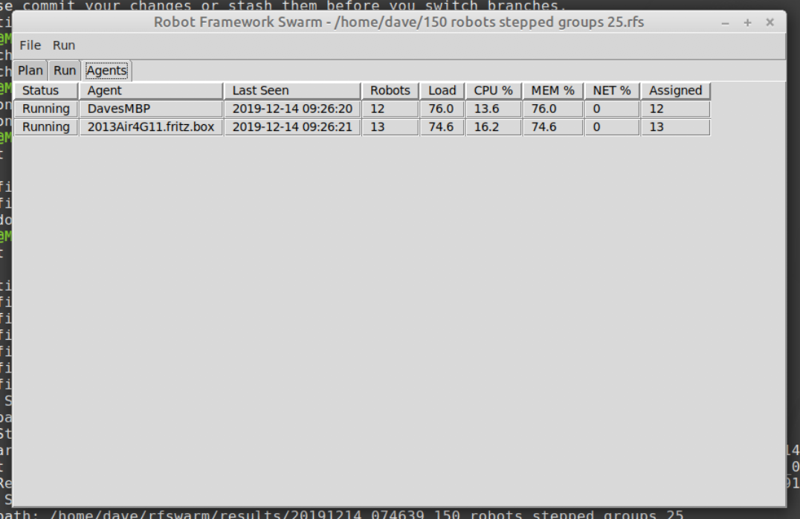
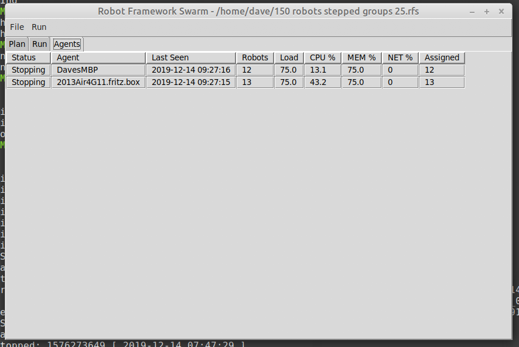

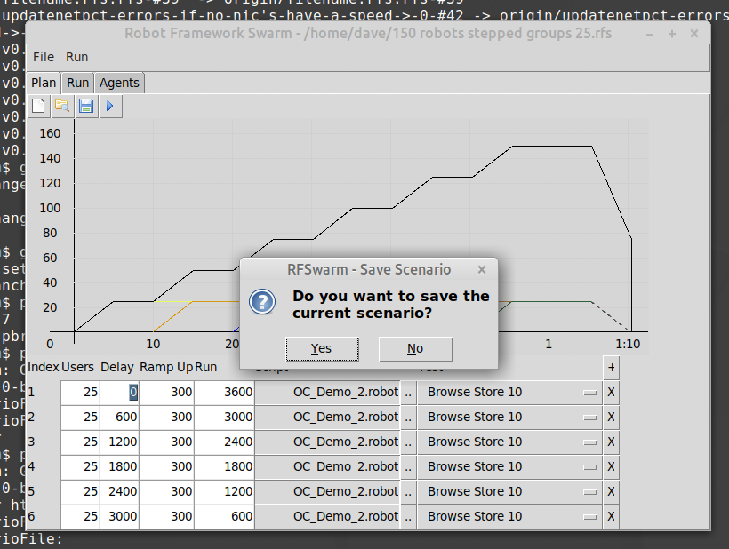
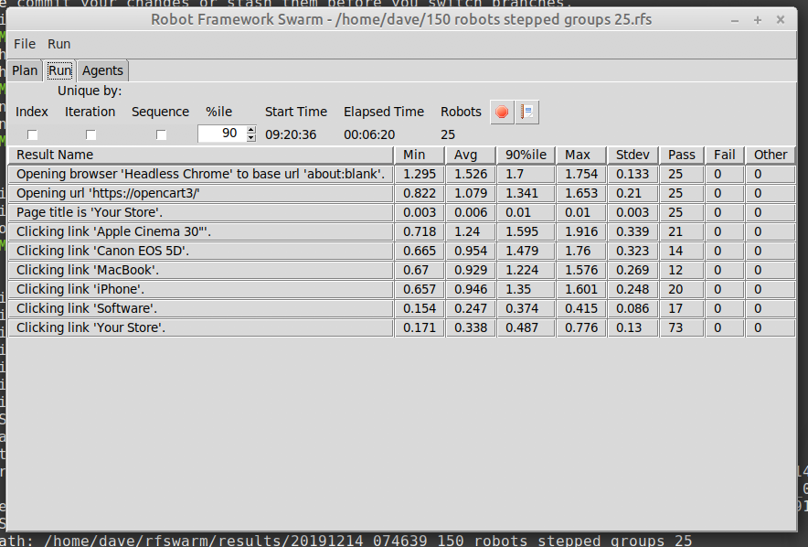
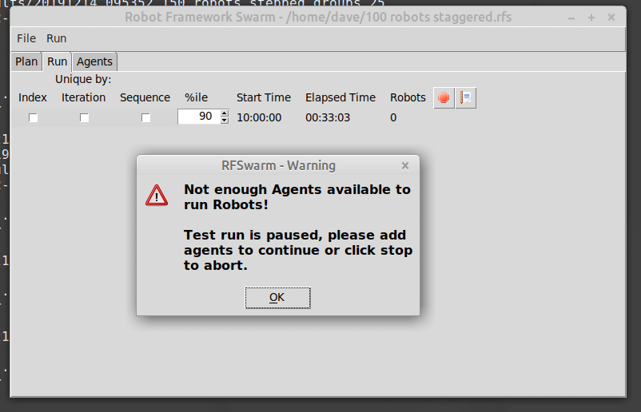

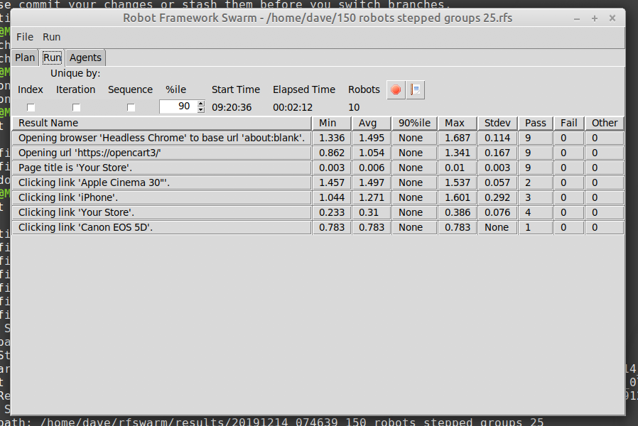

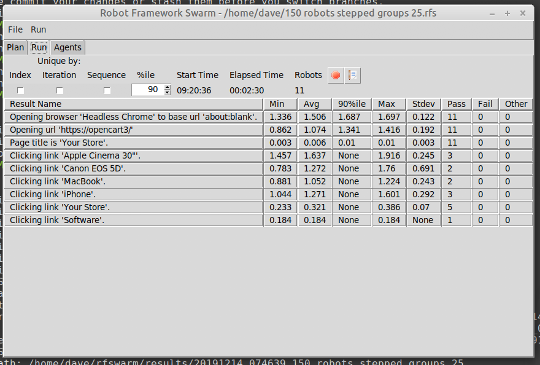
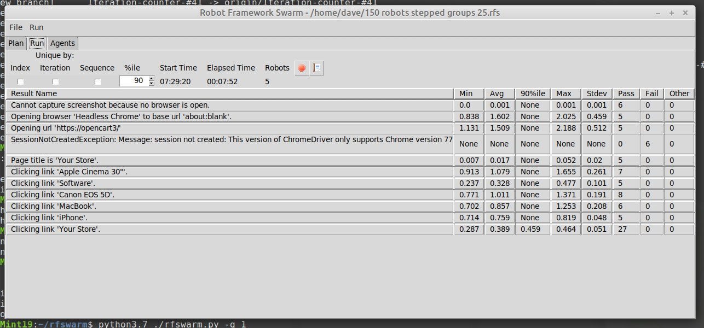

### v0.4.4

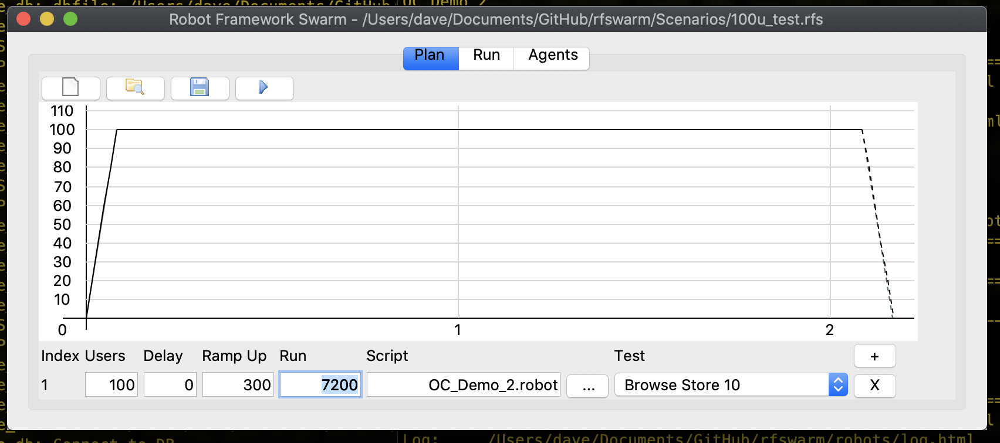

### v0.4.3

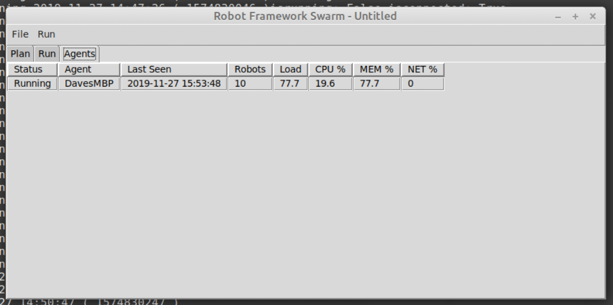

### v0.4

### v0.3

### v0.1

### Original

