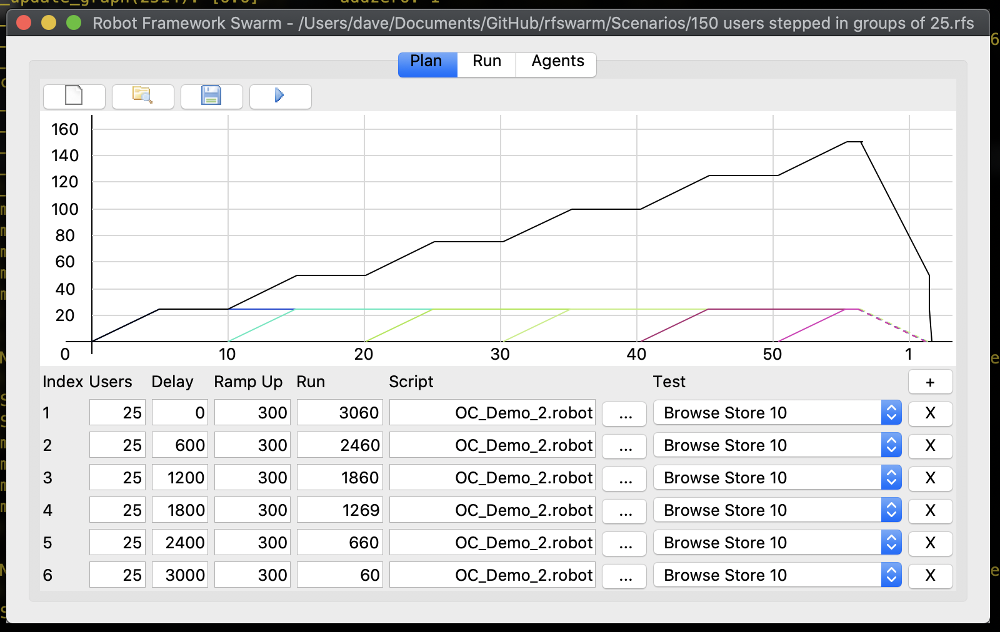
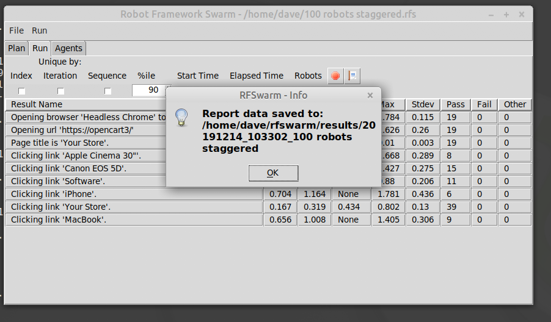

[Index](Index.md)

## rfswarm.py (GUI / Server)

rfswarm.py is the GUI and central server component of rfswarm, this is where you plan, execute and monitor your performance test.

- [User Interface](#User-Interface)
	- [Plan](#Plan)
	- [Run](#Run)
	- [Agents](#Agents)
- [Command Line Interface](#Command-Line-Interface)
- [Install and Setup](#Install-and-Setup)
	- [Install](#1-install)
	- [Adjust the Firewall](#2-Adjust-the-Firewall)
	- [Run the GUI Server](#3-Run-the-GUI-Server)
	- [Manual Install the prerequisites](#4-Manual-Install-the-prerequisites)
	- [Manual Run the GUI Server](#5-Manual-Run-the-GUI-Server)
- [Agent Assignment](#Agent-Assignment)
- [Credits](#Credits)

### User Interface
#### Plan
This is where you construct your test scenario, choose your test cases and number of virtual users. The interface should be intuitive and simple to understand but still allow fairly complex scenarios to be created.

All the time fields (Delay, Ramp Up & Run) are in Seconds, due to the way the [agent polling](./rfswarm_agent_py.md#agent-polling-of-the-guiserver) works it's best not to use values less than 10 seconds.

> _Plan - Planning a performance test_


> _Plan - New_


> _Plan - Delay example_


> _Plan - gradual ramp-up example_


> _Plan - Linux (Mint 19.2)_


While hopefully this is intuitive, the buttons are (starting top right)
- New			- Create a new scenario
- Open			- Open an existing scenario
- Save			- Save the current scenario
- Play			- Play the current scenario
- Add (+)		- Add another test group
- Select (...)	- Select a robot file
- Remove (X)	- Remove this test group

#### Run
This is where you monitor your test scenario as it runs, here you will see number of robots running, how long the has been running and live updates of the test results.

Unique by check boxes:
- Index, use this if multiple test cases have results with the same result name but you want to keep the result timings separated based on the individual test cases.
- Iteration, use this if you want to keep the result timings separated based on the test iteration.
- Sequence, use this if multiple test steps in the same test case have the same result name but you want to keep the result timings separated based on the sequence within the test case.

%ile (Percentile) field:
The default value is 90, you can adjust the percentile value between 1% and 99% depending on your application's performance requirements.

Stop button
Use this if you want to stop the test early. You may not notice an immediate reaction as pressing the button just changes the end time on all the test jobs assigned to the current time and stops the ramp-up if the test is still in the ramp-up phase. While there is no benefit to pressing the stop button multiple times there is no harm either, so press to your hearts content.
Once the stop button has been pressed the agents will receive the changed end time when they [poll](./rfswarm_agent_py.md#agent-polling-of-the-guiserver) the GUI/Server next, the agent will change status to stopping which will be returned on the next poll interval and the agent will not start a new iteration for the running tests, however the ones currently running will be allowed to complete.

CSV Report button
Use this to generate csv files suitable for use to create reports for your test run, there will be three files generated:
- A Summary file, this is the same data as on the run screen
- A Raw Results file, the is every data point recorded, useful if you want create response time graphs
- An Agents file, this is all the agent stats recorded, useful if you want to graph running robots or agent loads

> _Run - Just started_


> _Run - Just started, first results coming in_


> _Run - Showing results being collected live_


> _Run - Linux_


> _Run - Linux Report Saved_



#### Agents
This is where you can see which agents have connected, number of robots on each agent and monitor the status and performance of the agents.
> _Agents - Ready_


> _Agents - Running / Warning_


> _Agents - Stopping_


> _Agents - Running (Linux)_


### Command Line Interface

These command line options allow you to override the ini file configuration but do not update the ini file.

Additionally the debug (-g) levels 1-3 will give extra information on the console useful for troubleshooting your environment. debug levels above 5 are more for debugging the code and get very noisy so are not recommended for normal use.

```
$ rfswarm -h
Robot Framework Swarm: GUI/Server
	Version 0.6.1
usage: rfswarm [-h] [-g DEBUG] [-v] [-i INI] [-s SCENARIO] [-r] [-a AGENTS] [-n] [-d DIR] [-e IPADDRESS] [-p PORT]

optional arguments:
  -h, --help            show this help message and exit
  -g DEBUG, --debug DEBUG
                        Set debug level, default level is 0
  -v, --version         Display the version and exit
  -i INI, --ini INI     path to alternate ini file
  -s SCENARIO, --scenario SCENARIO
                        Load this scenario file
  -r, --run             Run the scenario automatically after loading
  -a AGENTS, --agents AGENTS
                        Wait for this many agents before starting (default 1)
  -n, --nogui           Don't display the GUI
  -d DIR, --dir DIR     Results directory
  -e IPADDRESS, --ipaddress IPADDRESS
                        IP Address to bind the server to
  -p PORT, --port PORT  Port number to bind the server to
```

If you pass in an unsupported command line option, you will get this prompt:
```
$ rfswarm -?
Robot Framework Swarm: GUI/Server
	Version 0.6.1
usage: rfswarm [-h] [-g DEBUG] [-v] [-i INI] [-s SCENARIO] [-r] [-a AGENTS] [-n] [-d DIR] [-e IPADDRESS] [-p PORT]
rfswarm: error: unrecognized arguments: -?
```

### Install and Setup

#### 1. Install
##### 1.1 Prerequisites
- The GUI/Server machine needs to use a minimum of Python 3.7
> ThreadingHTTPServer feature of HTTPServer requires was added in Python 3.7

- tkinter may need to be installed
It may already installed on your system, if not consult the [python documentation](https://tkdocs.com/tutorial/install.html) on how to install for your system.

On Debian based systems this will probably work
```
apt install python3-tk
```

##### 1.2 Install

Once you have the prerequisites sorted, the installation is simply
```
pip* install rfswarm-gui
```

\*some systems might need you to use pip3 and or sudo

#### 2. Adjust the Firewall

Check if there is a firewall on you GUI / Server machine, if so you may need to adjust the firewall to add a rule to allow communication between the GUI / Server and the Agent.

| Machine | Protocol | Port Number<sup>1</sup> | Direction |
|---|---|---|---|
| GUI / Server | TCP | 8138 | Inbound |
| Agent | TCP | 8138 | Outbound |

<sup>1</sup> This is the default port number, replace with the port number you used if you changed it in the ini file or used the -p command line switch.

Most firewalls on servers and workstations don't require specific rules for outbound, so most likely you will only need to configure the Inbound rule on the GUI / Server machine if it has a firewall.


#### 3. Run the GUI Server

```
rfswarm
```

#### 4. Manual Install the prerequisites

- The GUI/Server machine needs to use a minimum of Python 3.7
> ThreadingHTTPServer feature of HTTPServer requires was added in Python 3.7

- tkinter may need to be installed
It may already installed on your system, if not consult the python documentation on how to install for your system.

On Debian based systems this will probably work
```
apt install python3-tk
```

Additionally the following pip command might be needed if these are not already installed on your system:
```
pip* install configparser setuptools hashlib HTTPServer pillow
```
> setuptools (is required by hashlib and HTTPServer)

\*some systems might need you to use pip3 and or sudo

#### 5. Manual Run the GUI Server

Use this method if you did not install using pip

```
python* rfswarm.py
```
\*or python3 on some systems


### Agent Assignment

As a result of experience with other load testing tools and difficulties in managing load generation machines, the agent assignment algorithm in rfswarm has been designed to switch modes to cater for several scenarios but not require manual intervention

The scenarios rfswarm has been designed to cater for:

1. Need to ensure each agent gets only 1 virtual user each
2. When there is a low number of virtual user, you want them distributed evenly across all the agents
3. When the agent machines are a variety of hardware (newer and older machines) you don't want the virtual user distributed evenly across all the agents, but rather you want the more powerful agents to take a larger share of the virtual users to avoid any agent getting overloaded.

How the assignment algorithm works:
- As the scenario is ready to start the next virtual user the GUI/Server calls the assignment algorithm
- First the assignment algorithm sorts the agents list by the number of virtual users assigned to each agent
- The agent with the lowest number of assigned virtual users is selected, there may be several agents with the equal lowest number of virtual users, e.g. at the start of the test all agents equally have zero (0) virtual users assigned, then the first agent from the list with this assigned count is selected.
- Before returning the selected agent the assigned virtual user count is checked to see if it is greater than 10, if not the selected agent is returned from the assignment algorithm.
- If the selected agent's assigned virtual user count is greater than 10, the selection is discarded and the assignment algorithm returns to the agent list.
	- this time the agent list is sorted by the agent loads (See Load column in the screen shot of the agents tab above), where the load is simply the highest of the 3 monitored percentages (% CPU Usage, % Memory Consumption, % Network bandwidth usage)
	- the machine with the lowest load is selected and returned from the assignment algorithm.


### Credits

The icons used for the buttons in the GUI were derived from the Creative Commons licensed (Silk icon set 1.3)[http://www.famfamfam.com/lab/icons/silk/]
