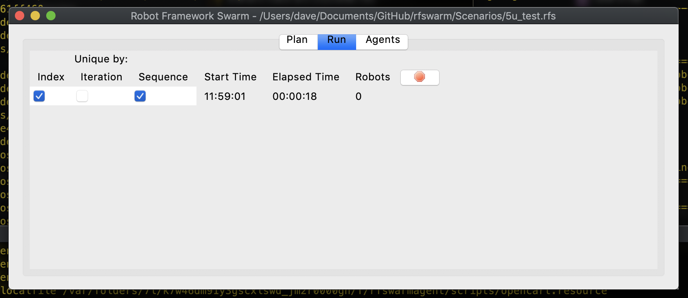
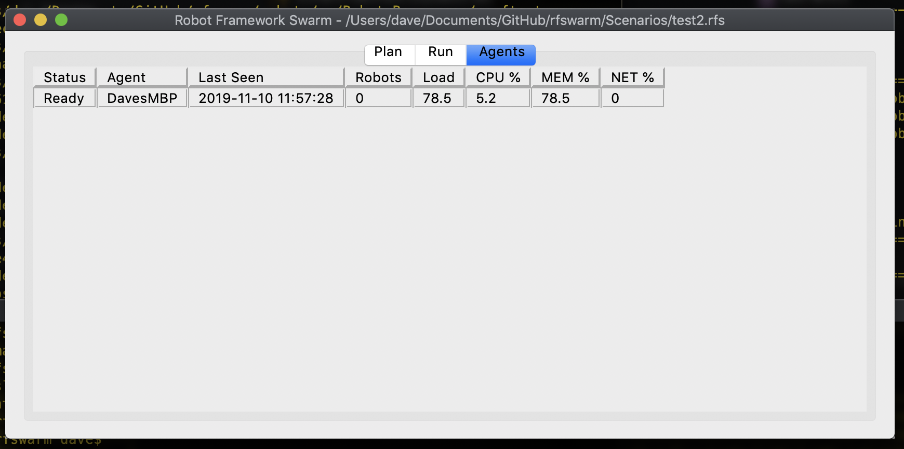

[Index](Index.md)

## rfswarm.py (GUI / Server)

rfswarm.py is the GUI and central server component of rfswarm, this is where you plan, execute and monitor your performance test.

- [User Interface](#User-Interface)
	- [Plan](#Plan)
	- [Run](#Run)
	- [Agents](#Agents)
- [Install and Setup](#Install-and-Setup)
	- [Install the prerequisites](#1-install-the-prerequisites)
	- [Run the GUI Server](#2-Run-the-GUI-Server)
- [Credits](#Credits)

### User Interface

Some screen shots below of rfswarm in action:
##### Plan
This is where you construct your test scenario, choose your test cases and number of virtual users


##### Run
This is where you monitor your test scenario as it runs, here you will see number of robots running, how long the has been running and live updates of the test results


##### Agents
This is where you can see which agents have connected, number of robots on each agent and monitor the performance of the agents



### Install and Setup

#### 1. Install the prerequisites

- The GUI/Server machine needs to use a minimum of Python 3.7
> ThreadingHTTPServer feature of HTTPServer requires was added in Python 3.7

- tkinter may need to be installed
It may already installed on your system, if not consult the python documentation on how to install for your system.

On Debian based systems this will probably work
```
apt install python3-tk
```

Additionally the following pip command might be needed if these are not already installed on your system:
```
pip* install configparser setuptools hashlib HTTPServer pillow
```
> setuptools (is required by hashlib and HTTPServer)

\*some systems might need you to use pip3 and or sudo


#### 2. Run the GUI Server

```
python* rfswarm.py
```
\*or python3 on some systems

### Credits

The icons used for the buttons in the GUI were derived from the Creative Commons licensed (Silk icon set 1.3)[http://www.famfamfam.com/lab/icons/silk/]
